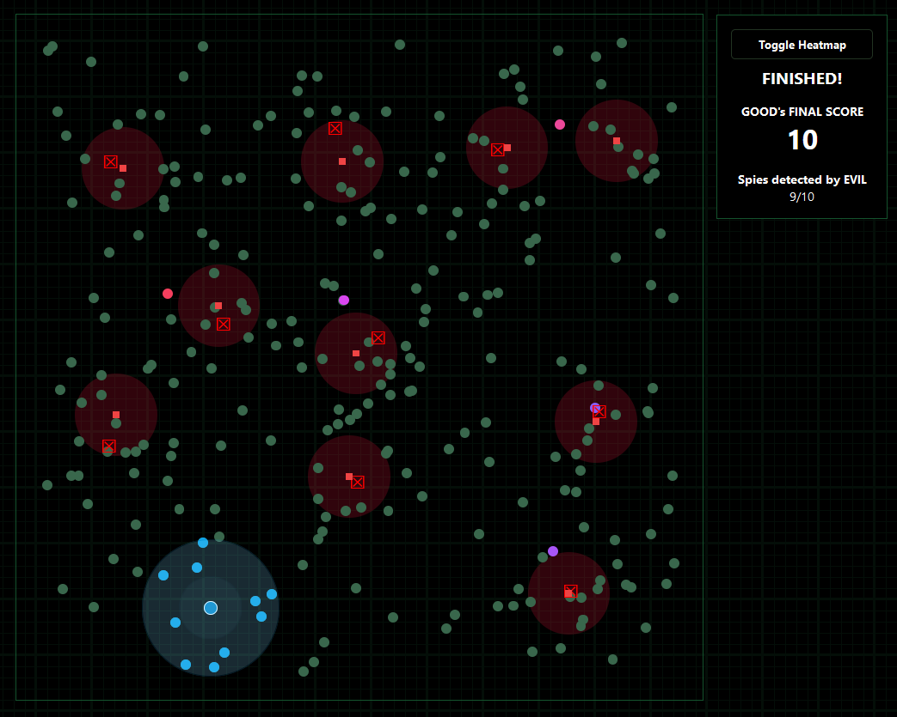

+++
title="Effective Eavesdropping"

[extra]
team="wjmn"
thumbnail="thumbnail.png"
+++

# Introduction

The Grand E.V.I.L. Banquet is approaching, where 250 members of the world's most Eminent Villainous Illegitimate Leaders (**E.V.I.L.**) will be gathered together in a banquet hall to celebrate their nefarious plans. You are the leader of the Group Of Obscure Detectives (**G.O.O.D.**), and are planning to send spies to the banquet to eavesdrop on E.V.I.L. in the best way you can. 

You have stolen a map of the seating plan, which shows where all the E.V.I.L. members (shown as green circles) will be seated in the banquet hall throughout the event. You can place a limited number of spies (shown as large blue circles with a white border) carrying wiretaps anywhere inside the banquet hall; each spy's wiretap will enable you to listen to E.V.I.L. members within a certain radius.

However, E.V.I.L. have been tipped off there are spies in their midst. After the spies have all taken their positions at the banquet (where they are disguised as ordinary E.V.I.L. members), E.V.I.L. places a limited number of anti-spy devices (shown as red squares) in the banquet hall one after the other. As soon as an anti-spy device is placed, it causes any wiretaps within a detection radius to explode - revealing the location/s of any spy/s around it and rendering them useless (shown as red crosses).

After E.V.I.L. has placed their anti-spy devices, G.O.O.D.’s score is the sum of the values of the people covered by its remaining spies. 

The value of ordinary E.V.I.L. members (shown as green circles) is 1; there are, however, five special E.V.I.L. members (shown as purple/pink circles) with values 5 to 9. G.O.O.D. will see the value covered by a potential spy above their cursor as they hover around the board. The current total value covered by all of G.O.O.D's spies is also shown at the side. A heatmap showing the value of a spy at every position in the board can be toggled on or off. 

Good luck, and may G.O.O.D. prevail. 

